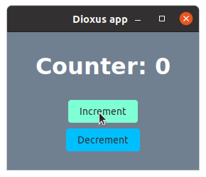

# Style in Rust

Write SCSS in your component functions

## Usage with Dioxus

Add the dependency to `Cargo.toml`:

```toml
[dependencies]
sir = { version = "0.1.0", features = ["dioxus"] }
```

Render the `AppStyle` component somewhere in your app:

```rust
use sir::AppStyle;

fn App(cx: Scope) -> Element {
    cx.render(rsx!(AppStyle {}, Counter {}))
}
```

Now, use the `css!` and `global_css!` macros to style your app!

```rust
use sir::{css, global_css};

fn Counter(cx: Scope) -> Element {
    let mut count = use_state(&cx, || 0);

    global_css!("
        body {
            background: slategray;
        }
    ");

    let container = css!("
        display: flex;
        flex-direction: column;
        align-items: center;
        gap: 4px;
    ");

    let title = css!("color: white");

    let button = css!("
        border: none;
        padding: 8px 16px;
        border-radius: 4px;
        
        background: deepskyblue;
        transition: background 0.2s ease-out;

        &:hover {
            background: aquamarine;
        }
    ");

    cx.render(rsx!(
        div {
            class: "{container}",
            h1 { class: "{title}", "Counter: {count}" }
            button { class: "{button}", onclick: move |_| count += 1, "Increment" }
            button { class: "{button}", onclick: move |_| count -= 1, "Decrement" }
        }
    ))
}
```



See `examples/dioxus_counter.rs` for the complete example.

## Features

`sir` uses [`rsass`](https://github.com/kaj/rsass) for all the [SCSS](https://sass-lang.com/) compiling. `rsass` is
incomplete, but "usable for personal projects".

## Similar Crates

[Rustyle](https://github.com/project-rustyle/rustyle-abandoned) looks really cool, but it's not very well-documented and
has been abandoned. It appears that Rustyle implements all parsing and code generation from scratch.

[css_rs_macro](https://docs.rs/css-rs-macro/0.1.0/css_rs_macro/macro.css.html) from
the [Percy](https://github.com/chinedufn/percy) project looks promising as well, but it uses a custom, slightly more
verbose syntax, and
the [current implementation](https://github.com/chinedufn/percy/blob/master/crates/percy-css-macro/src/lib.rs) looks a
bit hacky.

<small>feel free to include other similar crates here – i did some research but the current CSS+Rust situation looks a
bit sad.</small>

## Technical details

At compile time, a class name is generated for each `css!()` macro. The provided SCSS is wrapped in a selector for that
class and compiled using [`rsass`](https://crates.io/crates/rsass).

At each `css!` call site, some code is generated that will register the resulting CSS to the global `CSS_COLLECTION`
variable at runtime. A static `bool` is used to make sure that we only register the CSS once.

### Why not collect all CSS at compile time?

I could be wrong, but it seems there's no clean way to globally collect CSS at compile time. Procedural macros only work
on individual items (or, experimentally, on individual files). Build scripts aren't allowed to modify source code (so we
can't easily sync up generated CSS `class`es with what gets returned by the `css!` macro), and would have to do source
code parsing on their own (error-prone and messy).

There's also [`linkme`](https://github.com/dtolnay/linkme) which could push some work to link time, but it appears to
have been abandoned.

<small>side note: wouldn't it be cool if Rust had source-code preprocessors?.. kinda like Webpack for JS with all the
plugins that take code as input and produce code as output.</small>